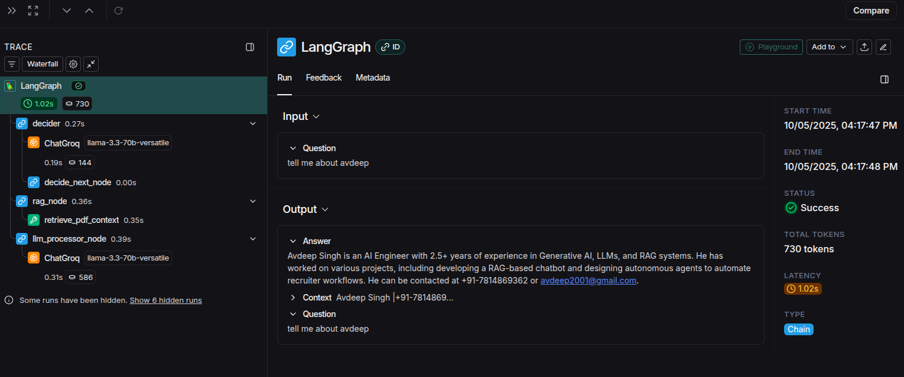
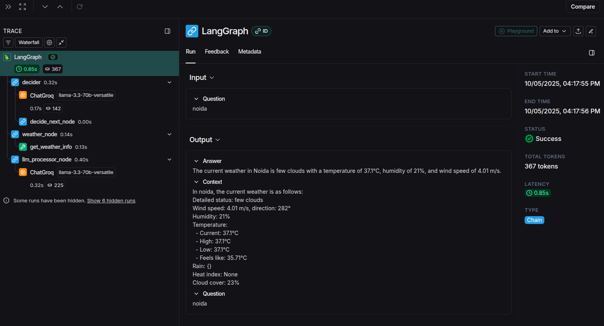

# LangGraph RAG & Weather Agent

This project implements a conversational agent built with LangChain and LangGraph. The agent can answer questions about a specific PDF document using Retrieval-Augmented Generation (RAG) and can also fetch real-time weather information for any city.

## Overview

The core of this project is a LangGraph agent that acts as a smart router. When a user asks a question, the agent first uses an LLM to decide whether the query is about the PDF document or about weather. It then routes the request to the appropriate tool, processes the tool's output, and generates a final, user-friendly answer.

## Architecture

The agent's logic is structured as a graph with the following nodes:

1.  **Decider Node**: Classifies the user's question as either `weather` or `rag`.
2.  **Weather Node**: If classified as `weather`, this node calls the OpenWeatherMap API to get current weather data.
3.  **RAG Node**: If classified as `rag`, this node retrieves relevant context from a Qdrant vector database populated with the PDF's content.
4.  **LLM Processor Node**: Takes the output from the tool nodes (weather data or PDF context) and generates a final, coherent answer for the user.

The project uses a local, file-based Qdrant instance for vector storage, Groq for fast LLM inference (llama-3.3-70b-versatile), and Hugging Face for text embeddings.

## Features

-   **Dual-Capability Agent**: Seamlessly handles both RAG-based document queries and live API calls for weather.
-   **Modular Codebase**: The project is structured into logical components for configuration, tools, agent logic, and UI.
-   **Local Vector Store**: Uses a file-based Qdrant instance, requiring no Docker or external database setup.
-   **Open-Source Models**: Leverages free tiers of Groq and Hugging Face, avoiding the need for paid API keys.
-   **Tracing & Evaluation**: Integrated with LangSmith for full observability and debugging of agent runs.
-   **Interactive UI**: A simple and clean web interface built with Streamlit.

## Setup and Installation

Follow these steps to set up and run the project locally.

**1. Clone the Repository**
```bash
git clone Avdeep-Singh/Neura-Dynamics-assignment
cd Neura-Dynamics-assignment
```

**2. Create a Conda Environment**
```bash
conda create -n langgraph-agent python=3.11
conda activate langgraph-agent
```

**3. Install Dependencies**
```bash
pip install -r requirements.txt
```

**4. Set Up Environment Variables**
Create a `.env` file in the root directory and add your API keys:
```
OPENWEATHERMAP_API_KEY=your_openweathermap_key
LANGCHAIN_API_KEY=your_langsmith_key
GROQ_API_KEY=your_groq_api_key
HUGGINGFACEHUB_API_TOKEN=your_huggingface_token
```

**5. Ingest PDF Data**
Place your PDF file in the `data/` directory and name it `sample.pdf`. Then, run the ingestion script to populate the vector database. This only needs to be done once.
```bash
python -m src.pdf_processor
```
This will create a `qdrant_storage` folder inside the `data` directory.

## How to Run

Once the setup is complete, you can run the Streamlit application:
```bash
streamlit run app.py
```
Open your web browser to `http://localhost:8501` to start chatting with the agent.

## LangSmith Tracing

This project is configured for tracing with LangSmith. All agent runs are logged, providing a detailed view of the graph's execution path and the inputs/outputs of each node.






## Test Results

Unit tests have been written for the API tools and vector database logic. To run the tests, execute the following command from the root directory:
```bash
pytest
```

```
=========================================================================================== test session starts ===========================================================================================
platform linux -- Python 3.11.13, pytest-8.4.2, pluggy-1.6.0
rootdir: /media/avi/b9ffd867-7807-4714-bc66-1ed63671353e/Neura-Dynamics
plugins: langsmith-0.4.32, anyio-4.11.0
collected 3 items                                                                                                                                                                                         

tests/test_api.py ..                                                                                                                                                                                [ 66%]
tests/test_retrieval.py .                                                                                                                                                                           [100%]

============================================================================================ warnings summary =============================================================================================
tests/test_retrieval.py::test_db_operations
  /media/avi/b9ffd867-7807-4714-bc66-1ed63671353e/Neura-Dynamics/src/vector_db.py:98: DeprecationWarning: `search` method is deprecated and will be removed in the future. Use `query_points` instead.
    search_result = client.search(

-- Docs: https://docs.pytest.org/en/stable/how-to/capture-warnings.html
====================================================================================== 3 passed, 1 warning in 1.24s =======================================================================================

```
